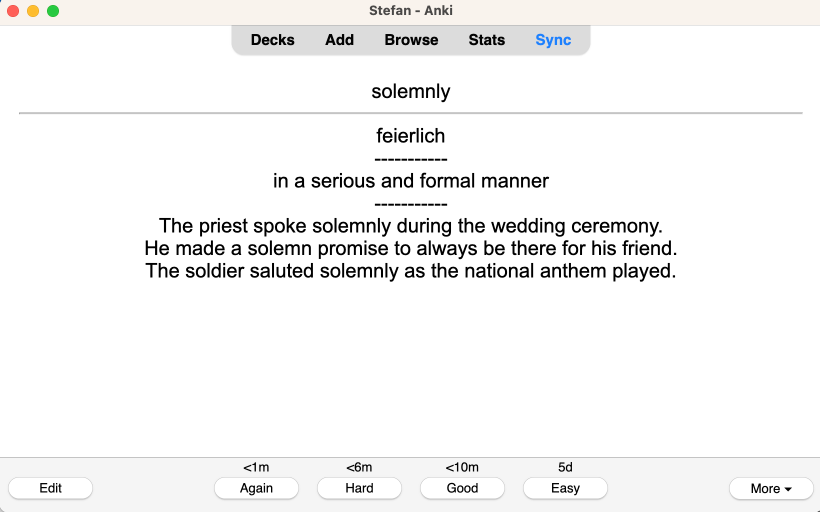

# chatgpt-flashcard-creator

This command-line tool converts a single-column `.csv` file containing unknown words into a double-column `.csv` file, where the first column represents the front of a flashcard (the unknown word), and the second column serves as the back (containing a definition, a translation and example usages). The back of flashcard is generated via ChatGPT.

The resulting .csv file is designed for seamless integration with Anki Desktop, a popular flashcard application. With just a few clicks, you can import the generated vocabulary list into Anki using the 'import text file' feature. https://docs.ankiweb.net/importing/intro.html

# Solved Problem

When I read books in a foreign language on my Kindle, like English, as I'm a native German speaker, I make a habit of highlighting all the unfamiliar words. After finishing the books, I send a `.csv` file of these highlights to my registered email address (https://help.goodreads.com/s/article/How-can-I-export-my-Kindle-Notes-and-Highlights-to-my-email).

Before creating this tool, the process of adding definitions, translations, and example usage for each word to my Anki deck was a manual and time-consuming task. However, with this tool, I can now generate the flashcard CSV file using ChatGPT and import it into my Anki deck.

# Usage

To create flashcards, you need to provide your ChatGPT API key. You can also specify the language of the words in the input, the desired language of the definition on the backside of the flashcard, and optionally, the desired language of the translation on the backside of the flashcard.

## Options

- `-k, --key <chatGPTApiKey>`: Your ChatGPT API key (required).
- `-w, --wordLang <language>`: Language of the words in the input (default: english).
- `-d, --definitionLang <language>`: Desired language of the definition on the backside of the flashcard (default: english).
- `-t, --translationLang <language>`: Desired language of the translation on the backside of the flashcard (optional).

## Example

```
cat input.csv | npx chatgpt-flashcard-creator -k YourChatGPTAPIKey -w english -d english -t german > output.csv
```

- `input.csv` must be formatted in UTF-8 encoding and contain a single column of data. Each cell in this column should represent an unknown word for which you intend to generate a flashcard. It's crucial to ensure that your .csv file adheres to this format for the tool to work. Please double-check the formatting and content of your .csv file!
- `output.csv` will be in UTF-8 format and consist of two columns, representing the front and back of the flashcard respectively.

# Example of generated flashcard


